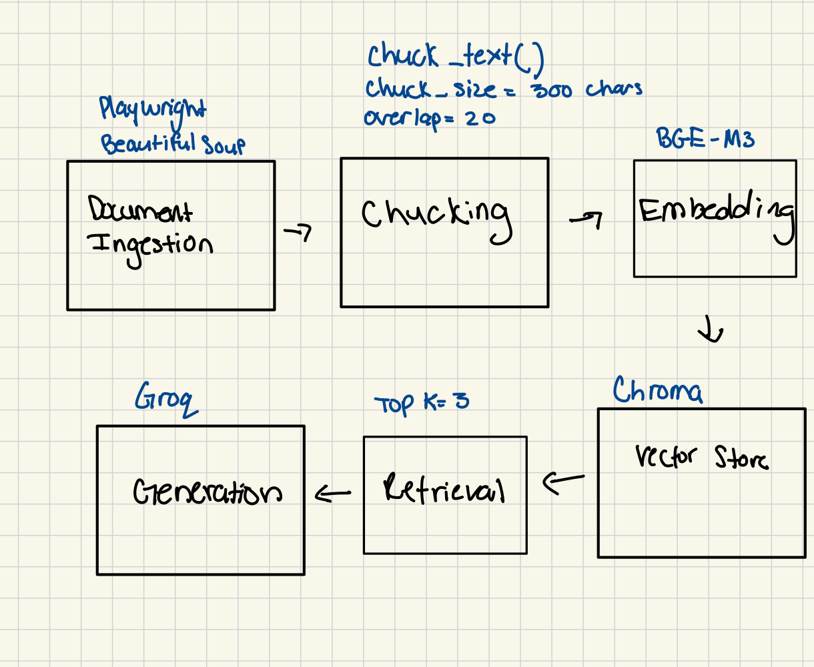

# Project 1 Planning: The Unofficial Guide

> Write this document before you write any pipeline code.
> Your spec and architecture diagram are what you'll use to direct AI tools (Claude, Copilot, etc.) to generate your implementation — the more specific they are, the more useful the generated code will be.
> Update the Retrieval Approach and Chunking Strategy sections if you change your approach during implementation.
> Update this file before starting any stretch features.

---

## Domain

<!-- What domain did you choose? Why is this knowledge valuable and hard to find through official channels? -->
 Student reviews of CS professors at Florida Atlantic University. They are valuable because official
     channels do not go in depth of the assignments, grades, and the best way to prepare for the class.

---

## Chunking Strategy

<!-- How will you split documents into chunks?
     State your chunk size (in tokens or characters), overlap size, and explain why those
     numbers fit the structure of your documents.
     A review-heavy corpus warrants different chunking than a long FAQ. -->
**Chunk size:**
300 characters
**Overlap:**
20
**Reasoning:**
These numbers fit the structure of my documents because they are RMP reviews  and have relatively short
paragraphs. It's small enough to be specific and big enough to get all the required context for the user query. 
---

## Retrieval Approach

<!-- Which embedding model are you using (e.g., all-MiniLM-L6-v2 via sentence-transformers)?
     How many chunks will you retrieve per query (top-k)?
     If you were deploying this for real users and cost wasn't a constraint, what tradeoffs
     would you weigh in choosing a different embedding model — context length, multilingual
     support, accuracy on domain-specific text, latency? -->

**Embedding model:**
BGE-M3 
**Top-k:**
3 chucks per query
**Production tradeoff reflection:**
The tradeoffs I would weigh are accuracy on domain-specific text and latency, ensuring that the speed between
user query and the retrieval is fast.
---

## Evaluation Plan

<!-- List your 5 test questions with their expected correct answers.
     Questions should be specific enough that you can judge whether the system's response
     is right or wrong. "What are good dining halls?" is too vague.
     "What do students say about wait times at [dining hall name] during lunch?" is testable. -->

| # | Question | Expected answer |
|---|--------|----------|-----------------|
| 1 | Do the reviews describe the workload as heavy, moderate, or light? | Answer must choose one of these exact labels and include a matching review term, such as "heavy", "manageable", or "light". |
| 2 | Which two assessment types are explicitly named in the reviews? | Answer must list exactly two assessment types that appear in the reviews, such as "projects", "programming assignments", "homework", "midterms", or "final exams". |
| 3 | Which two study strategies are explicitly recommended in the reviews? | Answer must list exactly two strategies or resources that appear in the reviews, such as "attend office hours", "start early", "use past exams", "practice problems", or "study groups". |
| 4 | Which clarity term and which responsiveness term are used to describe professors? | Answer must include one clarity term and one responsiveness term from the reviews, such as "clear", "unclear", "helpful", "responsive", "available", or "hard to reach". |
| 5 | Is a grading curve, TA issue, or organization issue mentioned in the reviews? | Answer must identify at least one of these exact issue types if it appears: "curve", "TA quality", "disorganized", "late feedback", or "difficult exams". |

---

## Anticipated Challenges

<!-- What could go wrong? Name at least two specific risks with reasoning.
     Consider: noisy or inconsistent documents, missing source attribution, off-topic
     retrieval, chunks that split key information across boundaries. -->

1. Chucks that split key information across boundaries because that will negatively affect the AI's response to the 
   user query. 

2. Hallucinations in the event that the model is not able to find the answer in the context.

---

## Architecture

<!-- Draw a diagram of your pipeline showing the five stages:
     Document Ingestion → Chunking → Embedding + Vector Store → Retrieval → Generation
     Label each stage with the tool or library you're using.
     You can use ASCII art, a Mermaid diagram, or embed a sketch as an image.
     You'll use this diagram as context when prompting AI tools to implement each stage. -->

---

## AI Tool Plan

<!-- For each part of the pipeline below, describe:
     - Which AI tool you plan to use (Claude, Copilot, ChatGPT, etc.)
     - What you'll give it as input (which sections of this planning.md, which requirements)
     - What you expect it to produce
     - How you'll verify the output matches your spec

     "I'll use AI to help me code" is not a plan.
     "I'll give Claude my Chunking Strategy section and ask it to implement chunk_text()
     with my specified chunk size and overlap" is a plan. -->

I'll give Copilot my Evaluation section and the example table format from this file. I expect it to produce 5 objective, testable questions with matching expected answers. I will verify that each answer can be checked against the reviews without relying on opinion or vague wording.

I'll give Copilot my Chunking Strategy section, including the chunk size and overlap values. I expect it to produce a `chunk_text()` implementation that splits review text into chunks that match the spec. I will verify the function against a few sample review excerpts to make sure chunk boundaries and overlap are correct.

I'll give Copilot the Domain, Documents, and Chunking Strategy sections. I expect it to produce code that loads the RateMyProfessor review data and splits it into chunks using my specified settings. I will verify the output by checking that the loaded reviews are preserved and that the chunking behavior matches the planned chunk size and overlap.

I'll give Copilot the Retrieval Approach section and the chunked document output from Milestone 3. I expect it to produce embedding and vector-store code that indexes the chunks and retrieves the top 3 matches for a query. I will verify that retrieval returns relevant chunks and that the chosen embedding model matches the plan.

I'll give Copilot the Evaluation Plan and the retrieval output format from Milestone 4. I expect it to produce the response-generation and user-interface code that answers questions using retrieved context and cites the source material. I will verify that the final answers stay grounded in the retrieved reviews and that the interface displays the result clearly.

**Milestone 3 — Ingestion and chunking:**

**Milestone 4 — Embedding and retrieval:**

**Milestone 5 — Generation and interface:**

